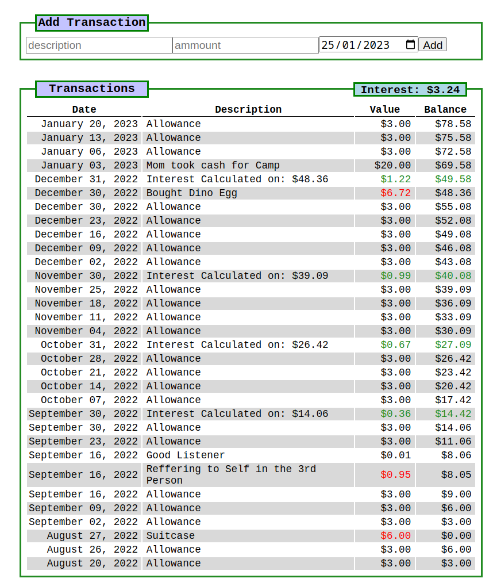

# Kid's Piggy Bank

This is a work in progress but fully functional to keep track of transactions for a Bank of Parents account for the kid(s).

Built with pocket base and react.

Currently calculates interest uusing a global rate from the env file, also interest calcs are Pseudo entries so not actually in the database until I figure out some sort of cron service.

